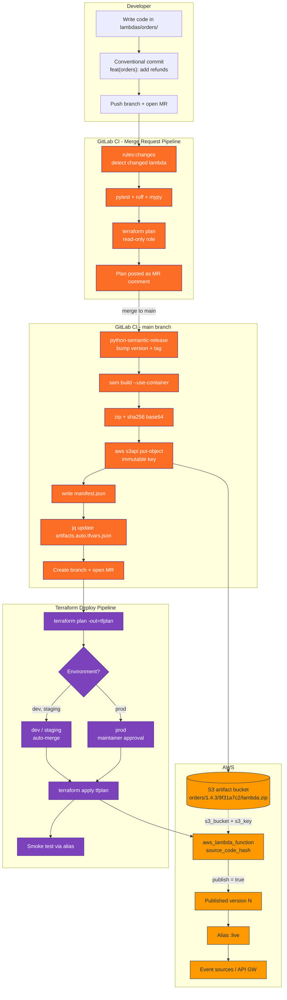

```mermaid
flowchart TD
    %% ---------- Developer ----------
    subgraph DEV["Developer"]
        A1["Write code in lambdas/orders/"]
        A2["Conventional commit<br/>feat(orders): add refunds"]
        A3["Push branch + open MR"]
    end

    %% ---------- MR Pipeline ----------
    subgraph MR["GitLab CI - Merge Request Pipeline"]
        B1["rules:changes<br/>detect changed lambda"]
        B2["pytest + ruff + mypy"]
        B3["terraform plan<br/>read-only role"]
        B4["Plan posted as MR comment"]
    end

    %% ---------- Main Pipeline ----------
    subgraph MAIN["GitLab CI - main branch"]
        C1["python-semantic-release<br/>bump version + tag"]
        C2["sam build --use-container"]
        C3["zip + sha256 base64"]
        C4["aws s3api put-object<br/>immutable key"]
        C5["write manifest.json"]
        C6["jq update artifacts.auto.tfvars.json"]
        C7["Create branch + open MR"]
    end

    %% ---------- AWS ----------
    subgraph AWS["AWS"]
        D1[("S3 artifact bucket<br/>orders/1.4.3/9f31a7c2/lambda.zip")]
        D2["aws_lambda_function<br/>source_code_hash"]
        D3["Published version N"]
        D4["Alias :live"]
        D5["Event sources / API GW"]
    end

    %% ---------- Deploy ----------
    subgraph TF["Terraform Deploy Pipeline"]
        E1["terraform plan -out=tfplan"]
        E2{"Environment?"}
        E3["dev / staging<br/>auto-merge"]
        E4["prod<br/>maintainer approval"]
        E5["terraform apply tfplan"]
        E6["Smoke test via alias"]
    end

    A1 --> A2 --> A3 --> B1
    B1 --> B2 --> B3 --> B4
    B4 -->|"merge to main"| C1

    C1 --> C2 --> C3 --> C4
    C4 --> D1
    C4 --> C5 --> C6 --> C7
    C7 --> E1 --> E2
    E2 -->|dev, staging| E3 --> E5
    E2 -->|prod| E4 --> E5
    E5 --> D2
    D1 -.->|"s3_bucket + s3_key"| D2
    D2 -->|"publish = true"| D3 --> D4 --> D5
    E5 --> E6

    classDef aws fill:#ff9900,stroke:#232f3e,color:#232f3e
    classDef gitlab fill:#fc6d26,stroke:#380d75,color:#fff
    classDef tf fill:#7b42bc,stroke:#4a2680,color:#fff
    class D1,D2,D3,D4,D5 aws
    class B1,B2,B3,B4,C1,C2,C3,C4,C5,C6,C7 gitlab
    class E1,E2,E3,E4,E5,E6 tf
```